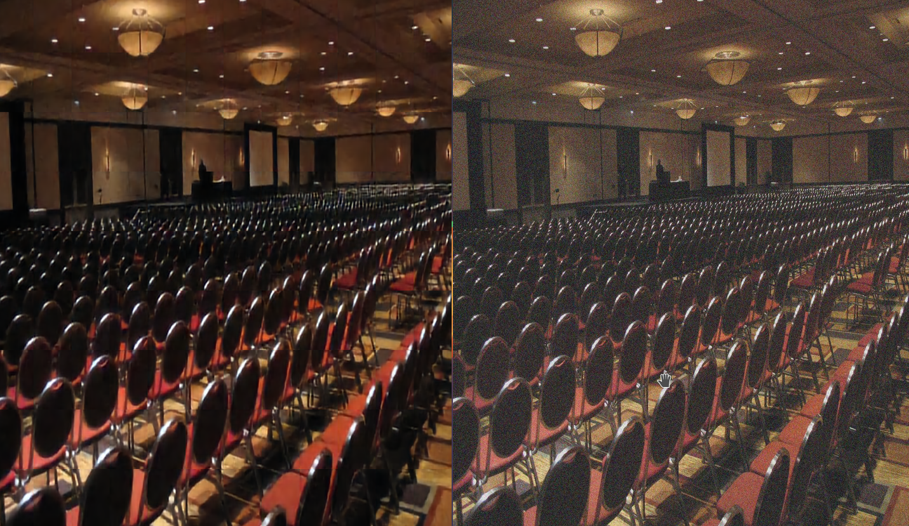
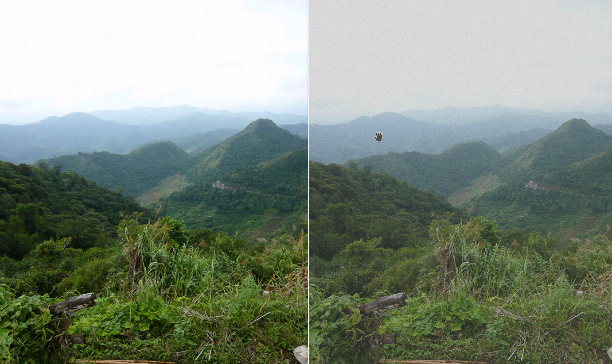
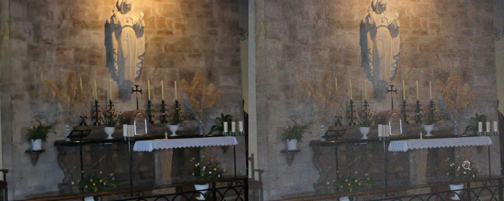
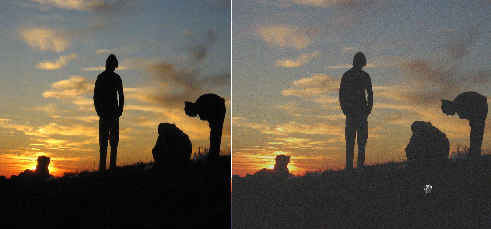
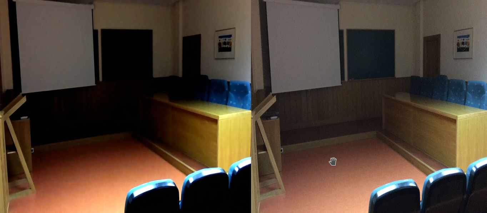

# aiphoto
Red neuronal para mejorar la calidad de las fotos.

##Descripción
En este repositorio se puede encontrar en *Jupyter notebook* con el código de una red neuronal convolucional desarrollada con Tensorflow (Keras). Esta red se encarga de corregir mala calidad en las fotos (desenfoque y ruido).

La arquitectura que mejor ha rendido hasta el momento puede encontrarse en el cuaderno.

Junto a el cuaderno se encuentra un script python `128_128_gen.py` que toma una imagen "grande" y la divide en secciones de 128x128 píxeles ya que la red neuronal trabaja sobre porciones de estas dimensiones.

##Entrenamiento

El conjunto de entrenamiento se compone de 812 imágenes descargadas de internet (no se proporciona debido a su peso 1,1G y porque no estoy seguro de que sus derechos lo permitan). 

De todos modos, para realizar nuevos entrenamientos, basta con:

1. Copiar las fotos originales (con la mejor calidad posible) a la carpeta `data/good`.
2. Ejecutar el script `128_128_gen.py`. Esto genera imágenes de 128x128 píxeles a partir de las originales en las carpetas `crops_bad` (empeoradas) y `crops_good` (originales).
3. Modificar las rutas (si es necesario) en el cuaderno

##Resultados
Los resultados conseguidos hasta la fecha pueden verse en el cuaderno (error medio de 5 en cada canal RGB).

Algunos ejemplos son (izquierda, corregida y derecha, empeorada):

